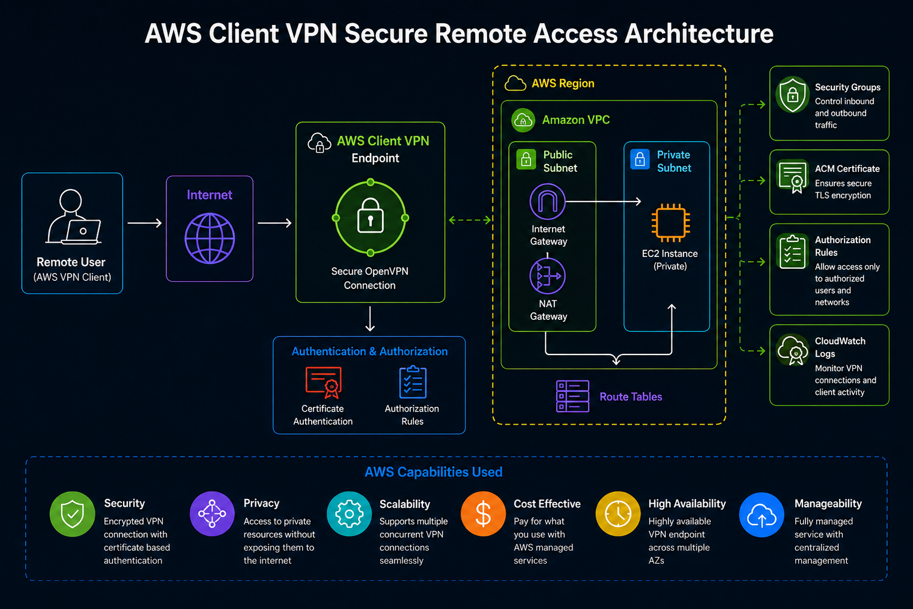
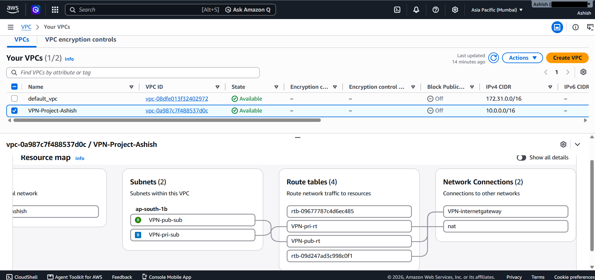
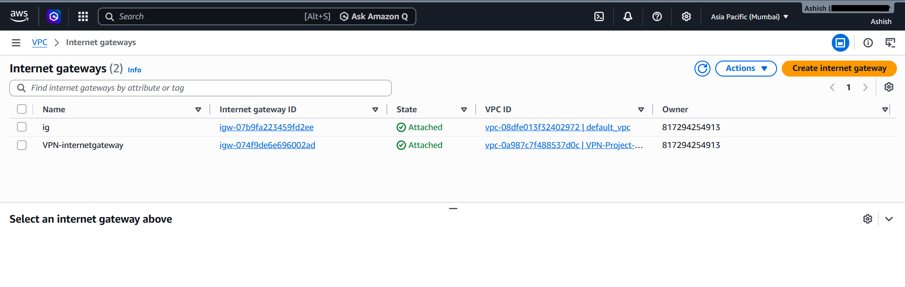
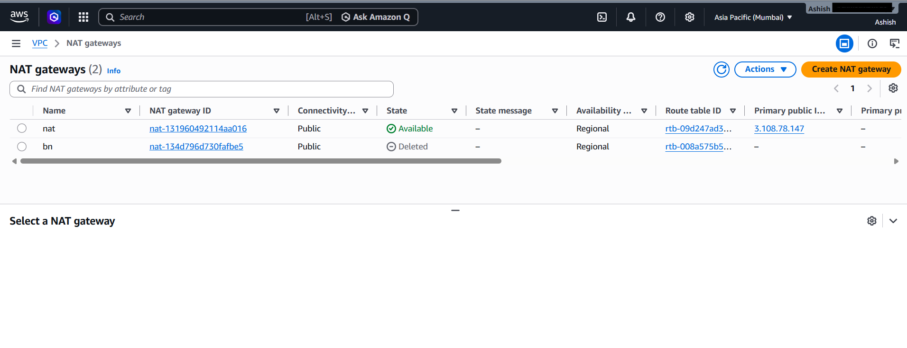
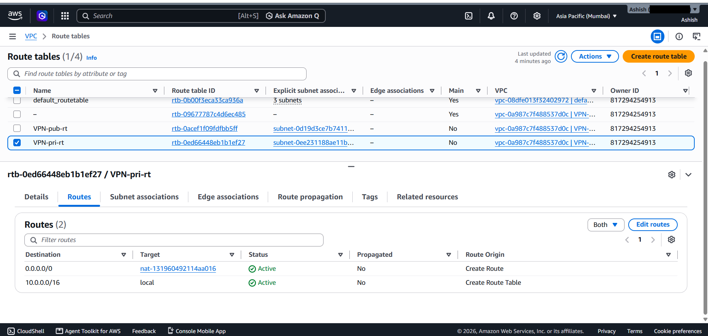
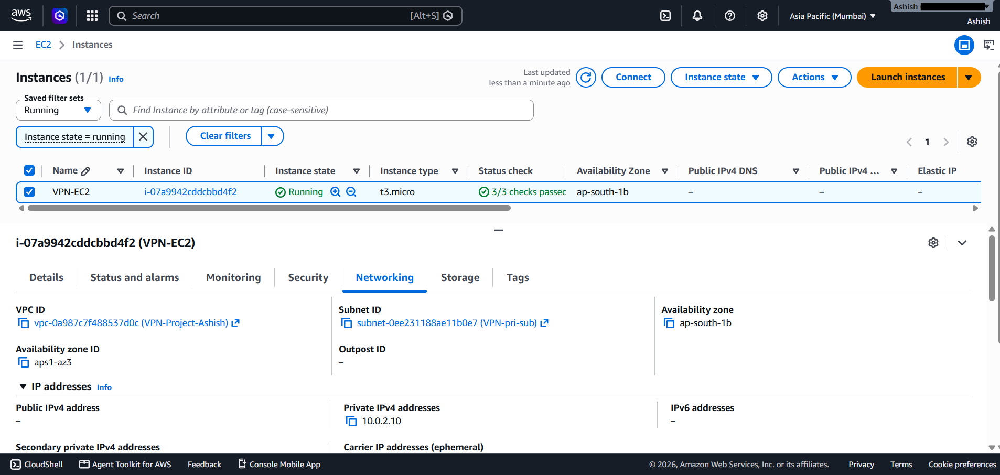
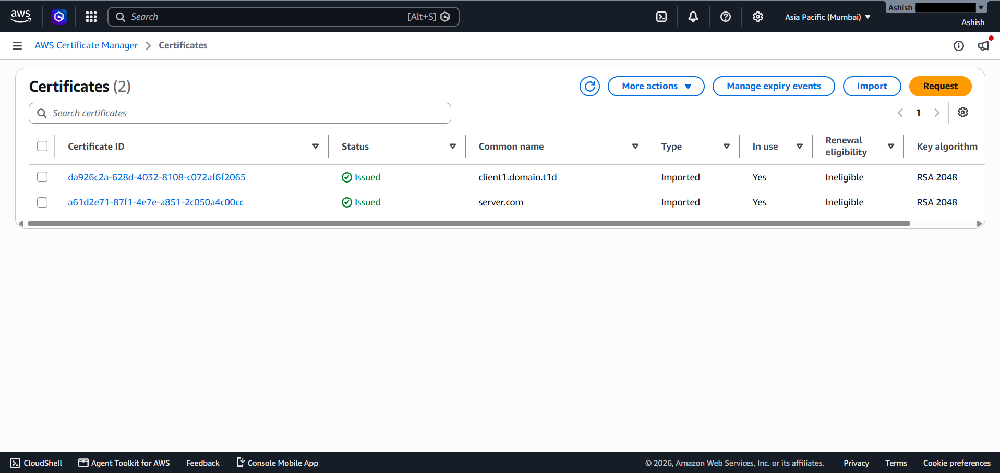
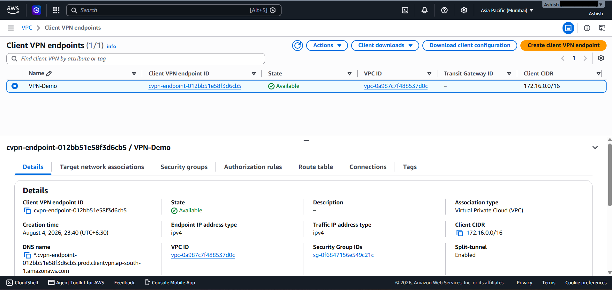
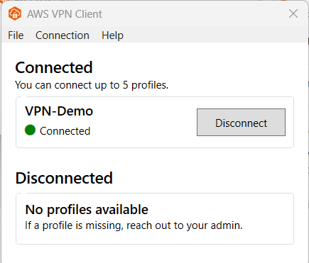

# AWS Client VPN Secure Remote Access

## Project Description

This project demonstrates the implementation of a secure remote access solution using AWS Client VPN. It covers the complete workflow of creating an Amazon VPC, configuring public and private networking components, deploying an Amazon EC2 instance, configuring an AWS Client VPN Endpoint, setting up authentication and authorization, configuring VPN routes, and securely accessing private AWS resources through an encrypted VPN connection.

---

## Project Objective

The objective of this project is to gain practical hands-on experience in configuring secure remote access to private AWS resources using AWS Client VPN. The project demonstrates VPC networking, routing, certificate-based authentication, authorization rules, Security Groups, encrypted VPN connectivity, and secure remote access to a private EC2 instance.

---

## AWS Services Used

- Amazon VPC
- AWS Client VPN
- Amazon EC2
- AWS Certificate Manager (ACM)
- Internet Gateway
- NAT Gateway
- Route Tables
- Security Groups

---

## Project Features

- Created and configured Amazon VPC
- Configured Internet Gateway
- Configured NAT Gateway
- Created Public and Private Route Tables
- Deployed Amazon EC2 Instance
- Configured EC2 Security Group
- Created and configured ACM Certificate
- Created AWS Client VPN Endpoint
- Configured Target Network Association
- Configured Authorization Rules
- Configured VPN Routes
- Downloaded and configured VPN Client Profile
- Established Secure VPN Connection
- Verified SSH Access to Private EC2
- Verified Network Connectivity using Ping

---

## Project Architecture

The project follows a secure remote access architecture where a remote user connects to an AWS Client VPN Endpoint through an encrypted OpenVPN connection. The VPN Endpoint provides authorized access to resources inside the Amazon VPC, including a private Amazon EC2 instance, while Route Tables, Security Groups, authentication, and authorization rules control network access.

### Architecture Diagram

---

## Project Workflow

1. Create Amazon VPC
2. Configure Internet Gateway
3. Configure NAT Gateway
4. Configure Public and Private Route Tables
5. Launch Amazon EC2 Instance
6. Configure EC2 Security Group
7. Configure ACM Certificate
8. Create AWS Client VPN Endpoint
9. Configure Target Network Association
10. Configure Authorization Rules
11. Configure VPN Route
12. Download Client VPN Configuration
13. Configure AWS VPN Client Profile
14. Establish VPN Connection
15. Verify SSH Access to Private EC2
16. Verify Network Connectivity using Ping

---

## Project Documentation

Complete project documentation with screenshots and detailed explanations is available in the **Documentation** folder.

---

## Configuration

Configuration details for Amazon VPC, Route Tables, NAT Gateway, Security Groups, ACM Certificate, AWS Client VPN Endpoint, Authorization Rules, and VPN Routes are available in the project documentation.

---

# Project Screenshots

## 1. Amazon VPC Created

---

## 2. Internet Gateway Configuration

---

## 3. NAT Gateway Configuration

---

## 4. Private Route Table

---

## 5. Amazon EC2 Instance

---

## 6. ACM Certificate

---

## 7. AWS Client VPN Endpoint

---

## 8. VPN Connection Successfully Established

---

## Repository Contents

- 📄 Project Documentation → `Documentation/`
- 🖼️ Project Screenshots → `Screenshots/`
- 🏗️ Architecture Diagram → `Architecture/`
- ⚙️ VPN Configuration Details → `Configuration.md`

---

## Skills Demonstrated

- AWS Client VPN
- Amazon VPC
- Amazon EC2
- AWS Certificate Manager (ACM)
- VPC Networking
- Public and Private Subnets
- Internet Gateway
- NAT Gateway
- Route Tables
- Security Groups
- VPN Routing
- Authorization Rules
- Certificate-Based Authentication
- OpenVPN
- Secure Remote Access
- Linux SSH
- Network Troubleshooting

---

## Author

**Ashish J Talekar**

AWS Cloud | Linux Administration | Networking

GitHub: https://github.com/Ashish-Talekar

LinkedIn: https://www.linkedin.com/in/ashish-talekar/

---

## License

This project is licensed under the MIT License.
